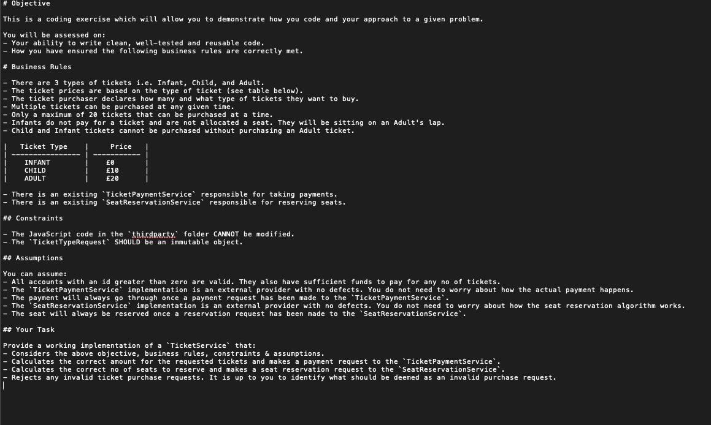

# Cinema Tickets JavaScript

## Table of contents

- [Description](#description)
- [Installation](#installation)
- [Technologies and Languages](#technologies-and-languages)
- [Contributing](#contributing)
- [Tests](#tests)
- [License](#license)
- [Screenshots](#screenshots)
- [GitHub repository](#github-repository)
- [Questions](#questions)

---

## Description

Using JavaScript I have been tasked to provide a working implementation of a `TicketService'.

---

## Installation

Start with cloning this repository link on to your local machine:

```
$ git clone https://github.com/riz1ash786/cinema-tickets-javascript
$ cd cinema-tickets-javascript
```

To install the required dependencies and set up the application, run:

```
$ npm i
```

---

## Technologies and Languages

<div>
&nbsp;
&nbsp;
&nbsp;
&nbsp;
</div>

---

[](https://github.com/riz1ash786/github-readme-stats)

## Contributing

If you are interested in contributing to this project then please feel free to get in touch with me via the contact information listed at the bottom of this README. Thank you.

---

## Tests

I attempted to create a test but unfortunately ran into errors when trying to run the test.

---

## License

 <br />
This application utilises the [ISC License](https://opensource.org/licenses/ISC "License Link")

---

## Screenshots



---

## GitHub Repository

<div id="badges">
  <a href="https://github.com/riz1ash786/cinema-tickets-javascript">
    
  </a>
</div>

---

## Questions

If you have any additional questions, then please feel free to get in touch via my github or email details linked below. Thank you.

<div id="badges">
  <a href="https://github.com/riz1ash786">
    
  </a> <br />
<div id="badges">
  <a href="mailto:riz1ash786@gmail.com">
    
  </a>
</div>
